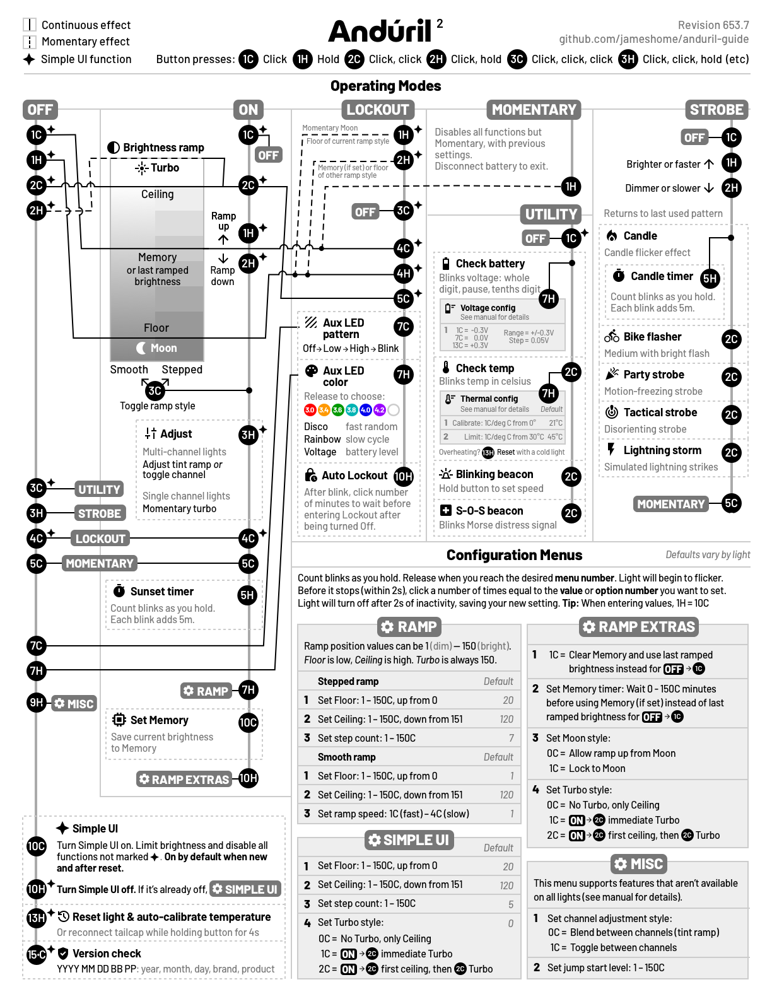

# A one page printable guide to Andúril 2

A one page printable guide to the [open source](https://code.launchpad.net/~toykeeper/flashlight-firmware/anduril2) Andúril 2 flashlight interface.

# Updates

Document revisions are numbered in the upper left corner with the firmware version number and a patch number to accomodate any corrections. Please [add an Issue](https://github.com/jameshome/anduril-guide/issues) if you discover an error.

# Thanks

Thanks to [Ivan Tse](https://ivanthinking.net/) for his excellent [Anduril 2 manual](https://ivanthinking.net/tags/anduril-2/), and to [Toykeeper](http://toykeeper.net/) for creating and maintaining this fantastic firmware.
